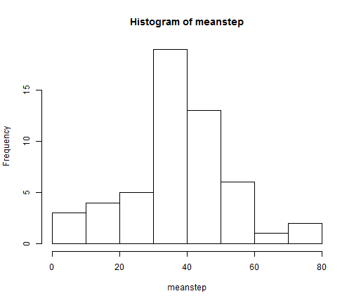
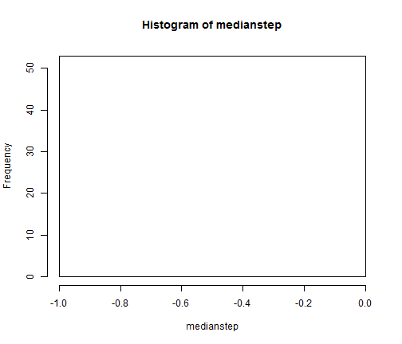
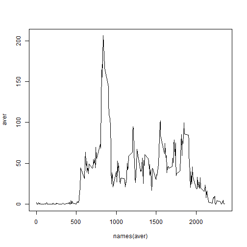
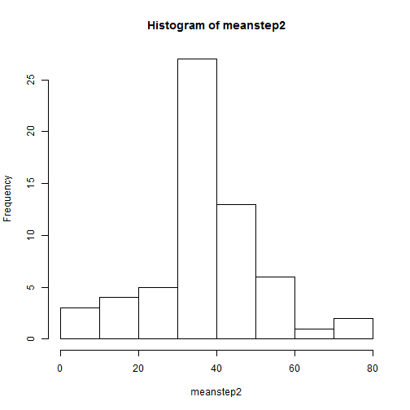
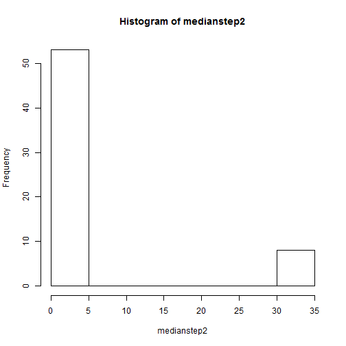
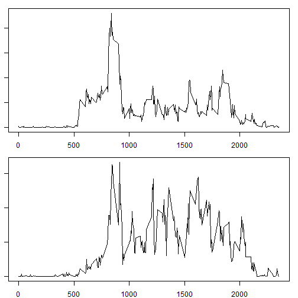

Reproduciable Couse Assignment
========================================================

- First Assignment

1. Problem 1


```r
temp = tempfile()
unzip("G:/Chrome Download/Bayesians/repdata-data-activity.zip", list = TRUE)
```

```
##           Name Length                Date
## 1 activity.csv 350829 2014-02-11 10:08:00
```

```r
temp1 = tempfile()
temp1 = unzip("G:/Chrome Download/Bayesians/repdata-data-activity.zip", "activity.csv")
data = read.csv(temp1, sep = ",", header = TRUE, na.strings = "NA")
data = transform(data, date = as.Date(as.character(date)))
```


2. Problem 2


```r
meanstep = tapply(data$steps, data$date, mean)
medianstep = tapply(data$steps, data$date, median)
hist(meanstep)
```

 

```r
hist(medianstep)
```

 


3. Problem 3


```r
aver = tapply(data$steps, data$interval, mean, na.rm = TRUE)
plot(names(aver), aver, type = "l")
```

 

```r
which(aver == max(aver))
```

```
## 835 
## 104
```

*The ansewer is appreantly 835 of the interval when gets to the maximum value.

4. Problem 4
The strategy I used is to substitute the missing values with average values across all
days in same time interval.

```r
sum(is.na(data[, 1]) | is.na(data[, 2]) | is.na(data[, 3]))  #This is to calculate the #missing value
```

```
## [1] 2304
```

```r
data2 = data
for (i in 1:dim(data)[1]) {
    if (is.na(data[i, 1]) == TRUE) {
        data2[i, 1] = aver[as.character(data[i, 3])]
    }
}
meanstep2 = tapply(data2$steps, data2$date, mean)
medianstep2 = tapply(data2$steps, data2$date, median)
hist(meanstep2)
```

 

```r
hist(medianstep2)
```

 


5. Problem 5

```r
week = weekdays(data2$date)
week = sub(pattern = "星期一", replacement = "weekday", week)
week = sub(pattern = "星期二", replacement = "weekday", week)
week = sub(pattern = "星期三", replacement = "weekday", week)
week = sub(pattern = "星期四", replacement = "weekday", week)
week = sub(pattern = "星期五", replacement = "weekday", week)
week = sub(pattern = "星期六", replacement = "weekend", week)
week = sub(pattern = "星期日", replacement = "weekend", week)
week = factor(week)
data2 = cbind(data2, factor(week))
data3 = subset(data2, week == "weekday")
data4 = subset(data2, week == "weekend")
par(mfrow = c(2, 1), mar = c(2, 1, 1, 1))
x1 = tapply(data3$steps, data3$interval, mean)
plot(names(x1), x1, type = "l")
x2 = tapply(data4$steps, data4$interval, mean)
plot(names(x2), x2, type = "l")
```

 


